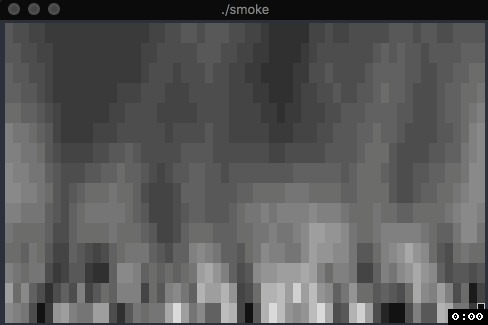

# Smoke

Make your terminal smoke.

```sh
curl https://smoke-tty.herokuapp.com
```



## Usage
By default smoke is rendered to STDOUT at 60x15 character resolution.

```sh
# see smoke with default options
./smoke


# fill your terminal whole terminal
./smoke -c `tput cols` -r `tput lines`

# fill your terminal at 60 FPS
./smoke -c `tput cols` -r `tput lines` --fps 60
```

*Note* You'll probably need a hardware accelerated terminal emulator to make the rendering smooth. [Kitty](https://github.com/kovidgoyal/kitty), [Alacritty](https://github.com/jwilm/alacritty), and [iTerm2 Beta](https://github.com/gnachman/iTerm2) with metal rendering do a great job on Mac.

## Server

Inspired by http://parrot.live, we can start an HTTP server to let people stream the results from `curl` and other CLI programs. 

```sh
# allow all address to port 3000
./smoke -p 3000

# allow only specific address to port 3000
./smoke -h 0.0.0.0 -p 3000

# allow public internet to port 80
./smoke -p 3000
```

### Client Request
```sh
# curl fetching defaults
curl http://localhost:3000

# curl with different cols rows
curl 'http://localhost:3000?cols=80&rows=25'
```

## Full Options
```
Usage: smoke [arguments]
    -h HOST, --host=HOST             server bind address
    -p PORT, --port=PORT             server bind port
    -c COLS, --cols=COLS             number of columns
    -r ROWS, --rows=NAME             number of rows
    --fps=FPS                        frame per second for stdout. Server mode capped at 15
    --help                           Show this help
```

## Docker

A `Dockerfile` is provided which borrows heavily from https://github.com/bcardiff/miniserver which helps to create a ~12MB image.

```sh
# run pre-build image
docker run -it --rm ddrscott/smoke

# build local image
docker build -t smoke .

# run local image
docker run -it --rm smoke

# run local image as server
docker run -it --rm -p 3000:3000 smoke -p 3000
```

## Development

Crystal doesn't support hot code reloading, so we use `entr` to restart the program anytime a source file changes.
```sh
ag --crystal -g . | entr -r crystal smoke.cr
```

## Contributing

Bug reports and pull requests are welcome on GitHub at https://github.com/ddrscott/smoke.

## License

The gem is available as open source under the terms of the [MIT
License](http://opensource.org/licenses/MIT).
